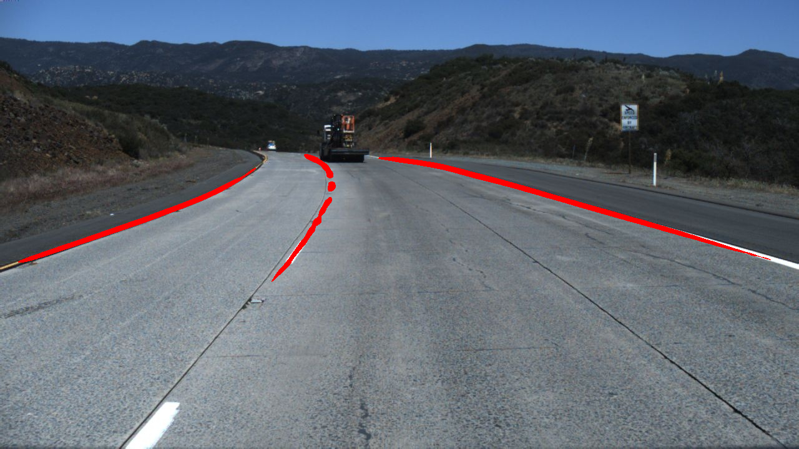

# **深度学习：unet网络语义分割识别车道线**
<!-- TOC -->

- [**深度学习：unet网络语义分割识别车道线**](#深度学习unet网络语义分割识别车道线)
  - [**项目背景**](#项目背景)
  - [**数据集**](#数据集)
  - [**环境**](#环境)
  - [**目录结构**](#目录结构)
  - [**结果**](#结果)
  - [**后续改进**](#后续改进)

<!-- /TOC -->
## **项目背景**
**起源于选修邸慧军老师的《数字图像处理》这门课程的最终课程设计项目 ：实现车道线检测**
1. 课程设计要求只能使用传统数字图像处理方法，自己的实现在https://github.com/april0228/-opencv-。入坑之后对计算机视觉产生了兴趣（因此毕业设计也是选了计算机视觉与三维医学图像相关的课题），加上毕业设计的要求因此自学了些皮毛，想使用深度学习方法再实现一遍课程设计，学习了一些经典语义分割网络（FCN,Unet)
2. 本项目使用unet进行分割（后期可能多学习几个经典网络模型进行分割和比较），当然，现在有专门车道线检测网络，本次实现只是为了验证自己的学习成果和测试unet的分割能力（据说在医学图像上的分割结果鲁棒性极好，产生了很多变体，unet++,nnunet)。
3. 还没有写一些评估指标函数，比如交并比IOU等，后期会进行编写，主要是考虑到后期可能再学习其他网络再进行对比。

## **数据集**
**usimple数据集，需要自己编写生成mask的脚本，下载和生成mask脚本参考http://t.csdn.cn/blf20**   
tusimple由于数据集太大（几万张？），自己只是训练集和测试集各选了几百张,下面是其中两张：   
  
  

## **环境**
**用的是谷歌的免费云算力colab,相比我自己的GPU，重点是使用起来也非常方便，无需申请，挂载数据方便，只需要有谷歌云盘账号就行。缺点是需要科学上网以及上传数据和写入数据到云盘速度比较慢，具体操作参考http://t.csdn.cn/xZdx0**

## **目录结构**
1. model
   unet_part.py
   unet_model.py
2. data
   1. train
        1. image(存放训练图片)
        2. label（存放训练mask）
   2. test
        1. image 
        2. label
3. main.ipynp(包括数据读入，训练神经网络，测试结果写入三个主要部分，如果是非云端环境就main.py,然后修改数据路径即可) 

4. save_model.pth(保存训练好网络供测试读入)

## **结果**
**见data/test/image下的所有res.png图片**   
其中一些结果如下：（效果相当粗糙，原因当然一个是网络参数，毕竟训练一次要好久。另一个是网络结构，但是大体上实现了分割的效果）  
 
   

## **后续改进**
1. 优化调参
2. 可能自己改进网络结构
3. 学习一些专门的lanenet
4. 编写评估指标函数

